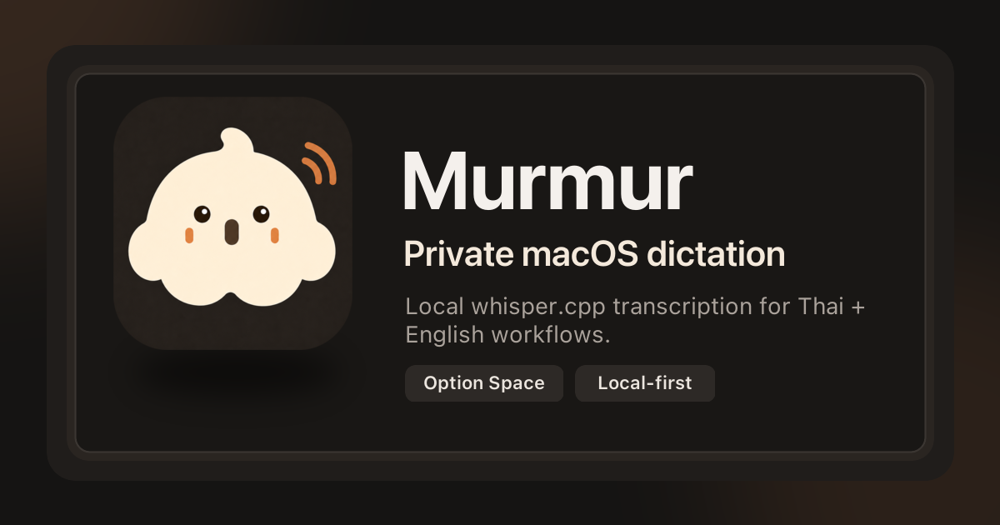

# Murmur

**Murmur** อ่านว่า **เมอร์-เมอร์** — เหมือนเสียงพูดเบา ๆ หรือเสียงพึมพำใกล้ตัว

Murmur เป็นแอป dictation สำหรับ macOS ที่อัดเสียง ถอดเสียงในเครื่องด้วย **whisper.cpp** แล้ว copy หรือ auto-paste ข้อความกลับไปยังแอปที่คุณใช้อยู่ จุดตั้งต้นคือเครื่องมือส่วนตัวที่ทำงานเงียบ ๆ กด `Option + Space` พูด แล้วได้ข้อความกลับมาโดยไม่ต้องส่งเสียงไปที่บริการภายนอก

> สถานะโปรเจกต์: early alpha / personal tool ที่กำลังขยับให้เปิดอ่านและต่อยอดได้ง่ายขึ้น ตอนนี้โฟกัส macOS ก่อนเป็นหลัก

เว็บไซต์ landing page อยู่ใน `site/` และ deploy ด้วย GitHub Pages: <https://mahirocoko.github.io/murmur/>



## ทำอะไรได้บ้าง

- กด global shortcut `Option + Space` เพื่อเริ่ม/หยุดอัดเสียงจากแอปไหนก็ได้
- ถอดเสียงด้วย `whisper.cpp` บนเครื่อง ไม่ต้องส่งเสียงขึ้น cloud
- รองรับ workflow ไทยปนอังกฤษ โดยตั้ง prompt ให้คงชื่อ product, technical terms และคำอังกฤษไว้
- เลือก microphone input ได้จาก main window และ tray menu โดยยังมีตัวเลือกใช้ system default
- copy transcript เข้า clipboard และ auto-paste กลับไปยังแอปที่ใช้อยู่
- มี floating indicator แบบ non-focusable พร้อม rolling waveform ระหว่างอัดเสียง
- มี main app shell แบบ sidebar สำหรับ Home, General, Models, History และ Permissions
- มี model library สำหรับดาวน์โหลด/จัดการ `ggml*.bin` models ใน app data
- เก็บ transcript history ไว้ในเครื่องผ่าน `localStorage`

## หน้าตาโดยรวม

Murmur ตอนนี้เป็นแอป shell เดียว ไม่ได้แยก Settings window แล้ว

- **Main window** — หน้าหลักแบบ sidebar มี Home/status, General settings, Models, History และ Permissions อยู่ในหน้าต่างเดียว
- **Indicator window** — pill ลอยเล็ก ๆ ที่แสดงสถานะ Recording / Transcribing / Pasting พร้อม waveform ที่ไหลตามการพูด
- **Tray / menu bar** — จุดเข้าใช้งานบน macOS สำหรับ toggle recording, เปิด main window, ไป History/General และ quit
- **Landing site** — Astro static site ใน `site/` สำหรับ GitHub Pages

## Tech stack

App:

- Tauri v2
- Rust
- React 19 + TypeScript + Vite
- CPAL สำหรับ native audio recording
- hound สำหรับเขียน WAV
- arboard สำหรับ clipboard Unicode
- CoreGraphics สำหรับ auto-paste บน macOS
- whisper.cpp / `whisper-cli` สำหรับ speech-to-text

Landing site:

- Astro 6
- Tailwind CSS 4
- shadcn-style Astro primitives (`Button`, `Card`, `Badge`) ด้วย CVA + `cn()`
- GitHub Pages workflow

## Requirements

ตอนนี้ Murmur พัฒนาและทดสอบบน macOS เป็นหลัก

- macOS
- Node.js + pnpm
- Rust + Cargo
- Tauri v2 prerequisites
- `whisper-cli` จาก whisper.cpp
- whisper model แบบ `ggml*.bin`

ถ้า Murmur หา `whisper-cli` ไม่เจอ สามารถตั้ง path เองได้

```sh
export MAHIRO_WHISPER_CLI=/opt/homebrew/bin/whisper-cli
```

Model หลักควรดาวน์โหลด/จัดการผ่าน Models section ในแอป เพื่อให้ไฟล์อยู่ใน Murmur app data และถูกเลือกอัตโนมัติได้ถูกต้อง

## Quick install

ถ้าอยาก build ไว้ใช้เองแบบเร็ว ๆ ให้ clone repo แล้ว build ตัว macOS app ได้เลย

```sh
git clone git@github.com:mahirocoko/murmur.git
cd murmur
pnpm install
pnpm tauri build
```

build เสร็จแล้วเปิดแอปจากไฟล์นี้ได้ทันที

```sh
open src-tauri/target/release/bundle/macos/Murmur.app
```

หรือเอา `Murmur.app` ไปวางใน `/Applications` เองก็ได้ ถ้าต้องการใช้เป็นแอปประจำ

ครั้งแรกที่ใช้งาน ให้เปิด Models ในแอปเพื่อดาวน์โหลด model ก่อน แล้วให้ macOS permissions ตามที่แอปแจ้ง โดยเฉพาะ Microphone และ Accessibility ถ้าจะใช้ auto-paste

## Quick start

สำหรับ development ให้รันแบบ dev server

```sh
pnpm install
pnpm build
cd src-tauri && cargo check
cd ..
pnpm tauri dev
```

คำสั่งที่ใช้บ่อย

```sh
pnpm build                 # typecheck frontend + build Vite
pnpm site:build            # astro check + build landing site
cd src-tauri && cargo check
cd src-tauri && cargo fmt --check
pnpm tauri build --debug
```

## วิธีใช้งานแบบสั้น

1. เปิด Murmur
2. ไปที่ Models แล้วดาวน์โหลดหรือเลือก model ที่ต้องการ
3. ตั้งค่า Language / Output / Microphone ใน General หรือเลือก microphone จาก tray menu ถ้าต้องการเปลี่ยนค่า default
4. กด `Option + Space` เพื่อเริ่มอัดเสียงจากแอปไหนก็ได้
5. กด `Option + Space` อีกครั้งเพื่อหยุด
6. Murmur จะถอดเสียง copy ข้อความ และ paste กลับไปยังแอปเดิมตาม output mode ที่ตั้งไว้

ถ้า auto-paste ไม่ทำงาน ให้เปิด macOS System Settings แล้วให้ Accessibility permission กับ Murmur

## macOS permissions

Murmur ต้องใช้ permission บางอย่างเพื่อให้ dictation flow ลื่นจริง

- **Microphone** — ใช้อัดเสียง
- **Accessibility** — ใช้ส่ง `Cmd+V` กลับไปยังแอปที่ active อยู่
- **Global shortcut** — ใช้ `Option + Space` สำหรับเริ่ม/หยุด dictation และ register `Esc` เฉพาะตอนกำลัง recording เพื่อ cancel

ตอน recording อยู่ `Esc` จะ cancel เสียงรอบนั้นจากแอปไหนก็ได้ แล้ว Murmur จะ unregister `Esc` ทันทีหลัง cancel/stop เพื่อไม่ให้กินปุ่ม Esc ของแอปอื่นตอนที่ไม่ได้อัดเสียง

## Privacy

Murmur ออกแบบเป็น local-first

- แอปอัดเสียงและถอดเสียงบนเครื่อง
- transcript history เก็บในเครื่อง
- model อยู่ใน app data หรือ path ที่ผู้ใช้เลือก
- ไม่มี server ฝั่งโปรเจกต์นี้สำหรับรับเสียงหรือ transcript

ถ้าเพิ่ม integration ใหม่ เช่น cloud transcription, sync, analytics หรือ crash reporting ควรระบุให้ชัดใน README และ UI ก่อนเปิดใช้จริง

## Project structure

```txt
src/
  App.tsx        # UI หลัก: main app shell + indicator window
  App.css        # custom window chrome, app shell, model/history, indicator styling

src-tauri/
  src/lib.rs     # native recording, tray, shortcut, whisper, clipboard, windows
  tauri.conf.json
  capabilities/default.json

site/
  src/pages/index.astro
  src/components/ui/
  src/styles/global.css

.github/workflows/pages.yaml

docs/
  plan.md
  development.md
```

## Development notes

อ่านเพิ่มได้ที่

- [docs/plan.md](docs/plan.md) — product/architecture plan
- [docs/development.md](docs/development.md) — local setup, current flow, debugging notes

ถ้าจะช่วยพัฒนา แนะนำให้เช็กอย่างน้อย

```sh
pnpm build
pnpm site:build
cd src-tauri && cargo check
```

ถ้าแตะ Tauri config, permissions, window labels, tray, global shortcut หรือ native recording ควรลอง `pnpm tauri build --debug` และ manual QA บน macOS ด้วย เพราะ build ผ่านไม่ได้แปลว่า window/permission behavior ถูกทั้งหมด

## Known limitations

- macOS-first ยังไม่ได้ออกแบบ cross-platform จริงจัง
- ยังเป็น early alpha API/UX อาจเปลี่ยนได้
- auto-paste ต้องพึ่ง Accessibility permission ของ macOS
- global shortcut อาจชนกับแอปอื่น
- ยังไม่มี automated test suite ใน repo นี้

## Contributing

ยินดีรับ issue, idea และ pull request โดยเฉพาะเรื่องเหล่านี้

- bug จาก macOS permission / shortcut / tray behavior
- model discovery และ model download UX
- Thai + English dictation quality
- indicator/window behavior บนหลายหน้าจอ
- landing page/docs ที่ช่วยให้ setup ง่ายขึ้น

ก่อนส่ง PR รบกวนรันอย่างน้อย

```sh
pnpm build
pnpm site:build
cd src-tauri && cargo check
```

ถ้าปรับโค้ด Rust และอยากเช็ก formatting ด้วย ให้รัน

```sh
cd src-tauri && cargo fmt --check
```

## License

Murmur เปิดภายใต้ [MIT License](LICENSE)
